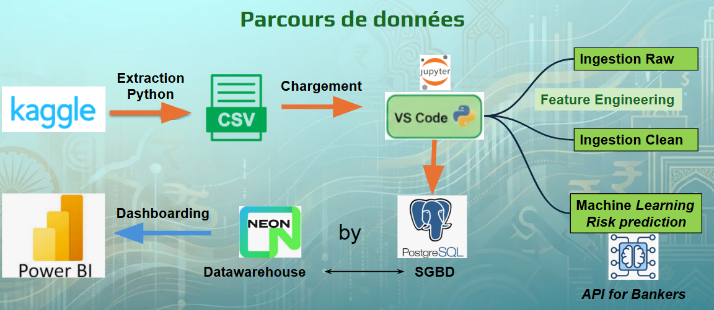

# 🏦 Stratégies de Crédit et Calibration du Risque : Comparatif Stratégique India vs USA


## 📄 Contexte et Objectifs

Dans un contexte où l’accès au crédit est un levier de développement économique, ce projet simule une mission de conseil pour une grande banque indienne.

**Le Défi :** La banque manque de données historiques sur les défauts de paiement pour définir un "bon" emprunteur.  
**La Solution :** Une approche par Benchmark. Nous utilisons un jeu de données mature des États-Unis (historique de remboursement) pour identifier les profils à risque, afin de calibrer et automatiser les décisions d'octroi de crédit en Inde.

### Les Jeux de Données
1.  **Loan Approval (Inde) :** Données actuelles de demandes de prêt (Cible : `Approved` / `Rejected`).
2.  **Loan Confirmation (USA) :** Historique de remboursement (Cible : `Paid` / `Default`).

---
## 📊 Résultats Clés & Insights Métier
L'analyse exploratoire et la modélisation ont permis de dégager trois axes stratégiques :  
**Corrélation Score/Risque** : Aux USA, les clients "Risky" paient jusqu'à 20% d'intérêts. Ce Risk-Based Pricing est absent en Inde et doit être implémenté.  
**Facteurs de Solvabilité** : La durée du prêt est critique. Les prêts courts (< 6 ans) présentent un meilleur taux de remboursement.

### Performance du Modèle
**Algorithme retenu** : ***Logistic Regression*** vs Random Forest.  
COMPARATIF PRÉCISION *(Sécurité Bancaire)*  
Logistic Regression : 90.06%  
Random Forest       : 89.57%  
Difference          : 0.49%  
**Gagnant** : Logistic Regression *(Plus sûr pour la banque)*

## ⚙️ Architecture Technique & Pipeline de Données

Nous avons mis en place un pipeline ELT (Extract, Load, Transform) complet, interconnectant Python, une base de données Cloud et des outils de Business Intelligence.

### 1. Flux de Données
* **Source :** Kaggle (Datasets bruts).
* **Traitement :** VS Code (Python / Pandas) pour le nettoyage et le Feature Engineering.
* **Stockage :** Neon (PostgreSQL) pour la centralisation.
* **Visualisation :** Power BI connecté en direct à la base de données.

### 2. Stratégie de Données : Architecture "Medaillon"
Pour garantir l'intégrité des données, nous avons structuré la base de données Neon en couches distinctes, sans jamais écraser la donnée source :

 Couche (Layer)  Nom de la Table (SQL)  Description & Usage 
 :---  :---  :--- 
 **Bronze (Raw)**  `loan_approval_raw`  Donnée brute, telle qu'importée du CSV. Sert de backup immuable. 
 **Silver (Clean)**  `loan_approval_clean`  Donnée nettoyée, typée et standardisée. Source principale pour **Power BI** (contient les ID et libellés). 
 **Gold (ML Ready)**  *(Géré via Python et DAX)*  Vue optimisée pour le Machine Learning : suppression des ID, encodage des variables catégorielles (One-Hot/Label Encoding). 



---

## 🛠️ Méthodologie et Transformations

### Phase 1 : Nettoyage et Feature Engineering
Avant l'analyse, les données ont subi un traitement rigoureux (Script Python) :
* **Nettoyage Standard :** Suppression des espaces (`strip`), correction des types (ID en string).
* **Création de segments (Binning) :**
    * *Âge :* <25, <35, <49, <60, >=60.
    * *Montant du prêt :* Segments de <9k$, 9-15k$, 15-21k$, >21k$.
* **Calcul de Ratios :** `debt_to_income_rating` classé en 4 niveaux (Excellent <20% à Danger >43%).
* **Harmonisation des Scores de Crédit :** Mapping du Score CIBIL (Inde) pour qu'il soit comparable aux standards FICO (USA).

### Phase 2 : Modélisation (Machine Learning)
* **Objectif :** Entraîner un modèle supervisé pour automatiser la décision d'approbation.
* **Algorithmes testés :** Régression Logistique vs Random Forest.
* **Processus :** Entraînement sur les profils USA (Risque avéré) pour prédire les décisions sur le marché Indien.

---

## 📂 Structure du Projet

```bash
projet-banking-risk
│
├── dashboard/
│   └── Loan_Analysis_final.pbix  # Dashboard Power BI final
│
├── dataset/
│   ├── raw/          # Datasets bruts (ne pas modifier)
│       ├── loan_approval_raw.csv
│       └── loan_confirmation_raw.csv
│   └── processed/    # Datasets nettoyés (Silver layer)
│       ├── loan_approval_clean.csv
│       └── loan_confirmation_clean.csv
│
├── image/
│   └── 10 photos - All graphics of notebook  # All final photos
│
├── notebooks/
│  └── Loan_Final_Project.ipynb  # Pipeline complet : Cleaning, EDA, ML
│
├── report/
│  ├── Loan-Project_Fullstack-Jedha-DataAnalysis-2026.mp4  # Video support de présentation
│  └── Loan-Project_Fullstack-Jedha-DataAnalysis-2026.pdf # Pdf support de présentation
│
└── Readme.md
```